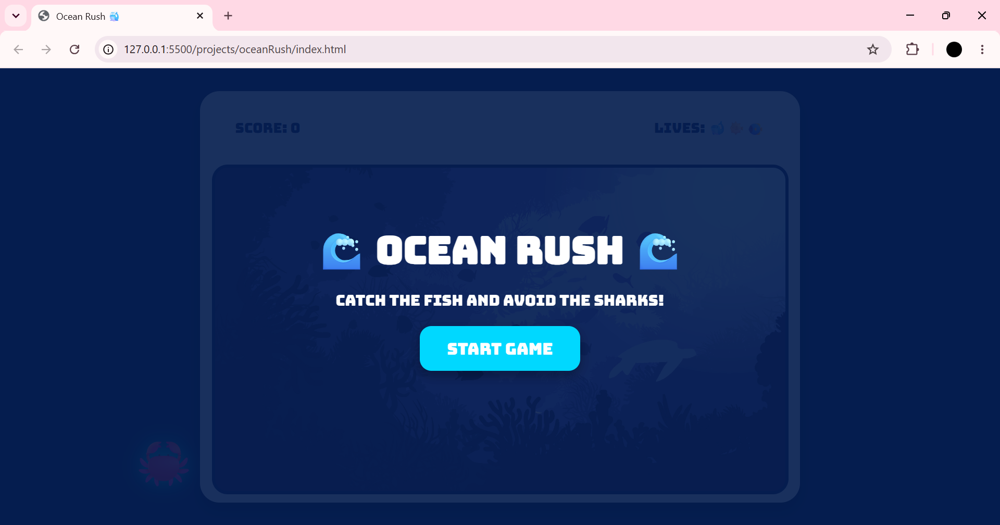

## Project Name
Ocean Rush🐳

## Description
Ocean Rush is a catching object game where the player catches fish to earn points while avoiding bombs. Catching a bomb causes the player to lose a life.

## User Stories

**1. Start Game:** The game starts when the player clicks the **Start** button.

**2. Score Points:** The player catches fish to increase their score and achieve the highest score possible.

**3. Three Lives:** The player starts with three lives. Catching a bomb causes the player to lose one life.

**4. Game Over:** The player must avoid bombs to stay alive. When all three lives are lost, the game stops and a **Game Over** screen is displayed.

**5. Restart:** The player can restart the game by clicking the **Restart** button on the **Game Over** screen. Restarting resets the score and lives.

## Screenshots

## Technologies
1. HTML
2. CSS
3. JavaScript

## Future Enhancements
- Add sounds and effects.
- Add multiple difficulty levels.
- Save and display the highest score.
- Add a timer and require the player to catch a certain number of fish before time runs out.
- Add a "Continue" feature that lets the player resume from where they lost.

## Credits
This game was developed by Zahraa.

For any recommendations or feedback, feel free to contact me via email.

